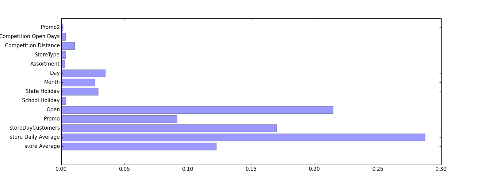

# Rossmann-Store-Sale

## Timeline
|Days reminding|Date|Event|
|-----|-----|-----|
|10|11.22| |
|9|11.23| |
|8|11.24| |
|7|11.25| |
|6|11.26| |
|5|11.27| |
|4|11.28| |
|3|11.29| |
|2|11.30| Write the report|
|1|12.01| Deadline|

## NOTICE
There are some mistake in data file (test.csv). I have found the solution in the official forums ([here](https://www.kaggle.com/c/rossmann-store-sales/forums/t/16835/open-is-blank-in-test-file-for-store-622)) and I have fixed it. Please use the data files in the Github.

## Data Format

The data is a [{}].

Every list represents a line in data file.
In every list, you can use data[i]['Sales'] to choose the attribute you want.

**Example of data[i]:**

	{'Customers': 555,
	 'Day': 3,
	 'DayOfWeek': 5,
	 'Month': 7,
	 'Open': 1,
	 'Promo': 1,
	 'Sales': 5263,
	 'SchoolHoliday': 1,
	 'StateHoliday': 0,
	 'Store': 1,
	 'Year': 2015}

'Store' is int

'DayOfWeek' is int

'Year' is int

'Month' is int

'Day' is int

'Sales' is int

'Customers' is int 

'Open' is int

'StateHoliday' is int (0,1,2,3)

'SchoolHoliday' is int (0,1)

## Features
features = ['store Average', 'store Daily Average', 'storeDayCustomers', 'Promo', 'Open', 'School Holiday', 'State Holiday', 'Month', 'Day', 'Assortment', 'StoreType', 'Competition Distance', 'Competition Open Days', 'Promo2']

featureImportances = [ 0.12229895  0.28713269  0.17011568  0.0913555   0.21450831  0.00335524
  0.02909692  0.02643554  0.03474152  0.00266027  0.00335206  0.01056023
  0.00317282  0.00121427]
        

## Reference
[How to read and write .csv in python](https://docs.python.org/2/library/csv.html)

[datetime](https://docs.python.org/2/library/datetime.html#datetime-objects)

[Ideas of features](https://www.kaggle.com/c/rossmann-store-sales/forums/t/17387/inputs-on-feature-engineering-for-store-prediction-regression-challenges)

## Submission Log

([d['Store'], d['DayOfWeek'], storeDayCustomers[d['Store']][d['DayOfWeek']], d['Promo'], d['Open']])

(n_estimators=200, n_jobs = -1, max_features = 'sqrt')

Training error 0.0544613850044

Validation error 0.192662345153

Test error 0.19773

---

X.append( [sum(storeAverage[d['Store']]) / len(storeAverage[d['Store']]), storeAverage[d['Store']][d['DayOfWeek']], storeDayCustomers[d['Store']][d['DayOfWeek']], d['Promo'], d['Open'], d['SchoolHoliday'], d['StateHoliday'], d['Month'], d['Day']]) 

estimator = RandomForestRegressor(n_estimators=10, n_jobs = -1, max_features = 'sqrt')

Training error 0.134116155801

Validation error 0.139443962653

Test error 0.15397

---

X.append( [sum(storeAverage[d['Store']]) / len(storeAverage[d['Store']]), storeAverage[d['Store']][d['DayOfWeek']], storeDayCustomers[d['Store']][d['DayOfWeek']], d['Promo'], d['Open'], d['SchoolHoliday'], d['StateHoliday'], d['Month'], d['Day']]) 

estimator = RandomForestRegressor(n_estimators=100, n_jobs = -1, max_features = 'sqrt')

Training error 0.136834269823

Validation error 0.136433584044

Test error 0.15127

---

[storeAverage[d['Store']], storeDayAverage[d['Store']][d['DayOfWeek']], storeDayCustomers[d['Store']][d['DayOfWeek']], d['Promo'], d['Open'], d['SchoolHoliday'], d['StateHoliday'], d['Month'], d['Day']])

estimator = RandomForestRegressor(n_estimators=10, n_jobs = -1, max_features = 'sqrt')

Training error 0.147619109854

Validation error 0.138442256117

Training error 0.144138207301

Validation error 0.137066365827

[storeAverage[d['Store']], storeDayAverage[d['Store']][d['DayOfWeek']], [d['DayOfWeek']], d['Promo'], d['Open'], d['SchoolHoliday'], d['StateHoliday'], d['Month'], d['Day']])

estimator = RandomForestRegressor(n_estimators=10, n_jobs = -1, max_features = 'sqrt')

Training error 0.145246249422

Validation error 0.139109906463

Training error 0.1475501462

Validation error 0.137777615749

---

[storeAverage[d['Store']], storeDayAverage[d['Store']][d['DayOfWeek']], [d['DayOfWeek']], d['Promo'], d['Open'], d['SchoolHoliday'], d['StateHoliday'], d['Month'], d['Day']])

estimator = RandomForestRegressor(n_estimators=100, n_jobs = -1, max_features = 'sqrt')

Training error 0.14051530975

Validation error 0.136242333983

Test error 0.15091

---

X.append( [storeAverage[d['Store']], storeDayAverage[d['Store']][d['DayOfWeek']], storeDayCustomers[d['Store']][d['DayOfWeek']], d['Promo'], d['Open'], d['SchoolHoliday'], d['StateHoliday'], d['Month'], d['Day'], storeInfo[d['Store']]['Assortment'], storeInfo[d['Store']]['StoreType'], storeInfo[d['Store']]['CompetitionDistance'], CompetitionOpenDays 

estimator = RandomForestRegressor(n_estimators=100, n_jobs = -1, max_features = 'sqrt')

Training error 0.0690124426818

Validation error 0.12779291288

Test error 0.13645

---

Add p2

estimator = RandomForestRegressor(n_estimators=100, n_jobs = -1, max_features = 'sqrt')

Training error 0.066

Validation error 0.1259

Test error 0.13586

---

estimator = RandomForestRegressor(n_estimators=300, max_depth = 30, n_jobs = -1, max_features = 'sqrt')

Training error 0.0783227771002

Validation error 0.124333540239

Test error 0.13499

---

